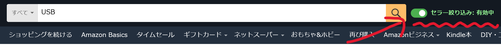

# Amazon公式セラー絞り込みトグル 🔄（p_6:AN1VRQENFRJN5対応）

## 📌 概要

Amazon.co.jp の検索結果に、**「Amazon公式セラー（p_6:AN1VRQENFRJN5）」の絞り込みトグルスイッチ**を直接追加するユーザースクリプトです。  
怪しいマーケットプレイス商品を除外して、Amazon直販の信頼できる商品だけをサッと表示できます。

  

- セラー絞り込みURL（`p_6=AN1VRQENFRJN5`）のON/OFFをワンタッチで切替
- 検索フォームにトグルUIを自動挿入
- 動的ルーティング（SPA）に完全対応
- Amazonのレイアウト崩れ（nav-active 問題）を自動修復
- 入力フォームと挙動を完全統合（エンターキーも対応）

## 🧩 対応サイト

- `https://www.amazon.co.jp/s*`（検索結果ページ）

## ⚙️ インストール方法

1. お使いのブラウザに Violentmonkey または Tampermonkey を導入
2. **[このスクリプトをインストールする](https://raw.githubusercontent.com/koyasi777/amazon-seller-filter-toggle/main/amazon-official-seller-filter-toggle.user.js)** ← クリックで直接インストール！
3. 自動でインストール画面が開きます。「インストール」を押せば完了！

## 💡 機能詳細

- トグルスイッチで `p_6=AN1VRQENFRJN5` の絞り込みをON/OFF
- 現在の絞り込み状態を視覚的に表示（色＋ラベル）
- キーワード入力・Enterキー・サジェストクリックすべてに対応
- URLの `rh` パラメータを動的に書き換え、再読み込みなしで絞り込み反映
- 状態は `localStorage` に保存 → ページ遷移後も維持
- モバイル対応（Amazon側レイアウト変更にも柔軟）

## 🛠 技術構成

- `localStorage` にトグル状態を記録し、セッション維持
- `MutationObserver` による動的要素へのサジェストクリックフック
- Amazonの SPA ナビゲーションにも `pushState` フックで対応
- `requestIdleCallback()` により初期化タイミングを最適化
- フォームの `.nav-active` クラス除去によるレイアウト安定化

## 🔗 関連リンク

- [Amazon公式セラーとは？（参考）](https://www.amazon.co.jp/)
- [Violentmonkey公式サイト](https://violentmonkey.github.io/)
- [Tampermonkey公式サイト](https://www.tampermonkey.net/)
- [このスクリプトのGitHubリポジトリ](https://github.com/koyasi777/amazon-seller-filter-toggle)

## 📜 ライセンス

MIT License  
自由に改変・再配布いただけますが、利用は自己責任でお願いします。

---

> 怪しい出品者に惑わされず、**Amazon公式の安心商品だけ**を素早く見たいときに。  
> このスクリプトが検索体験をスマートに変えてくれます。
